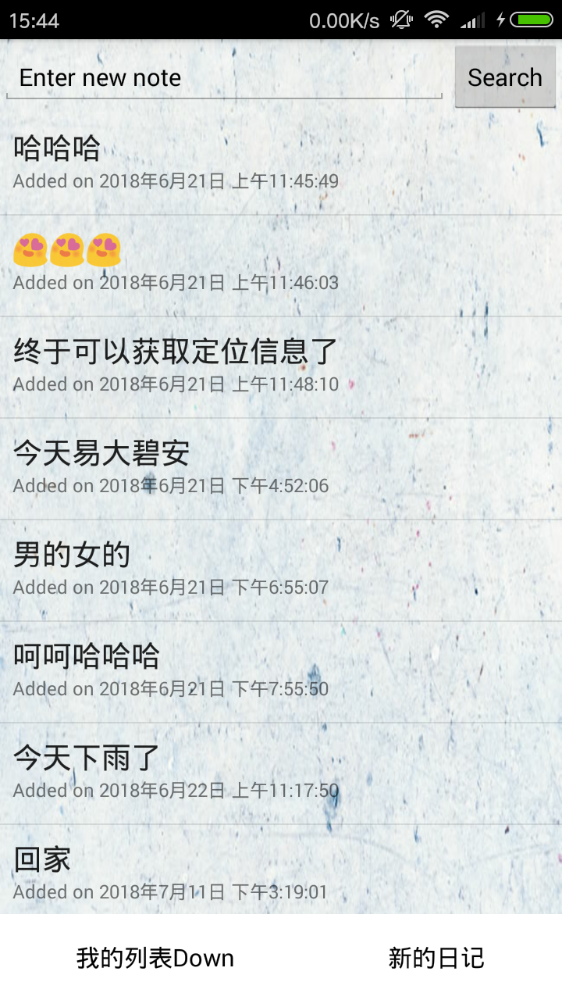
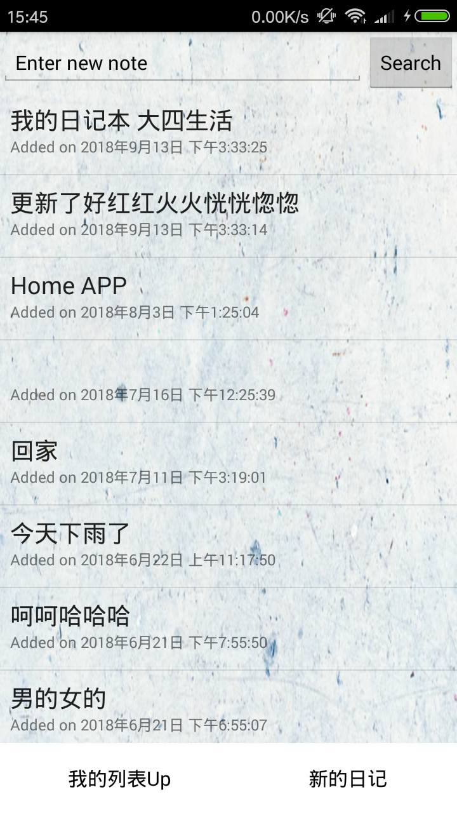
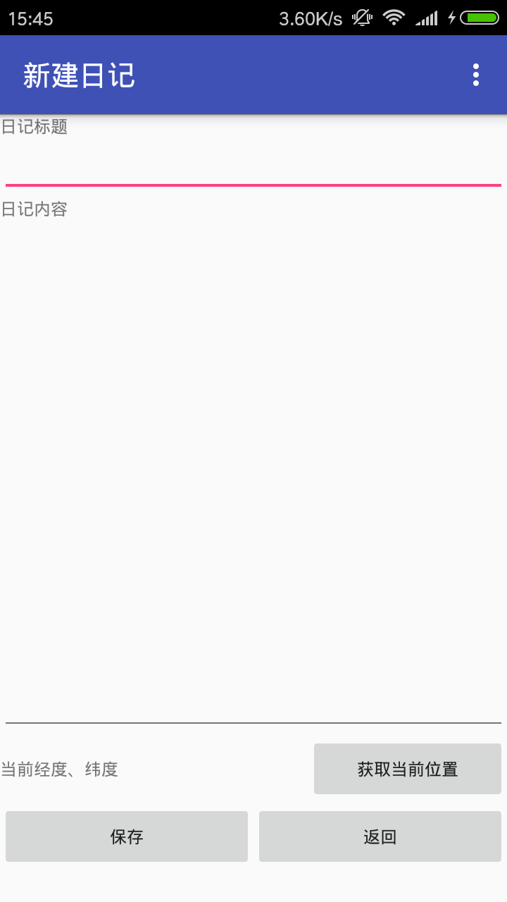
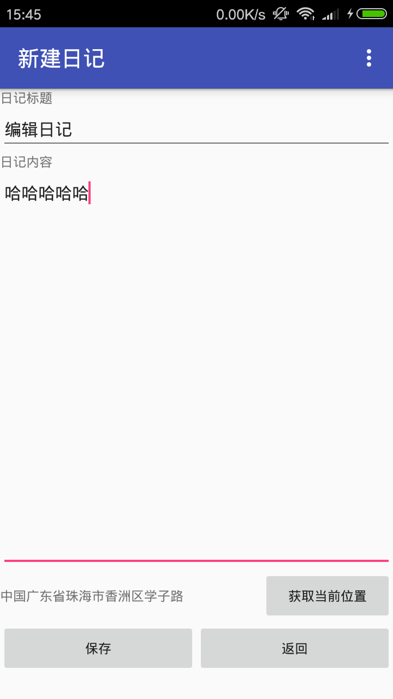
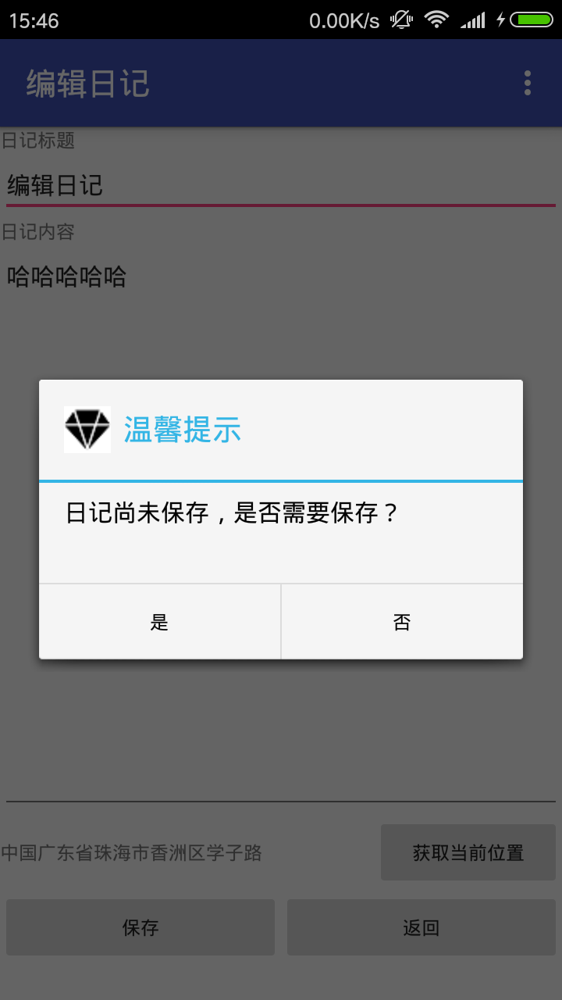
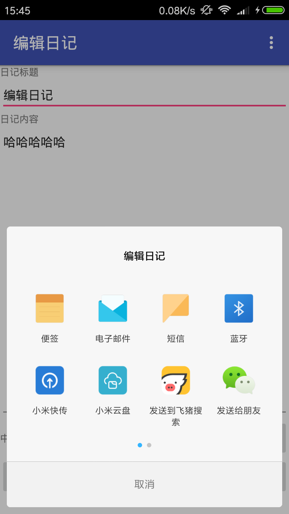
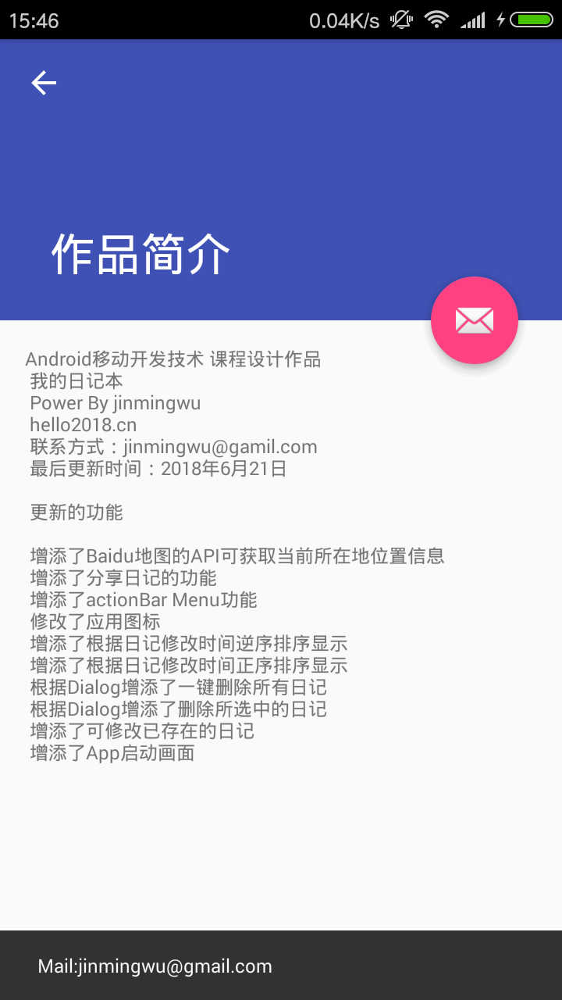

# 安卓_我的日记本APP

#### 项目介绍
"Android移动开发技术 课程设计作品"
"我的日记本"
"Power By jinmingwu"
"hello2018.cn"
"联系方式：jinmingwu@gmail.com"

"更新时间：2018年9月13日"
"更新功能"
"修正了Activity的生命周期"
"修正了Baidu地图API一直获取定位，无法正常停止"
"修正了错误字体"

"更新时间：2018年6月21日"
"更新功能"
"增添了Baidu地图的API可获取当前所在地位置信息\n"
"增添了分享日记的功能\n"
"增添了actionBar Menu功能\n"
"修改了应用图标\n"
"增添了根据日记修改时间逆序排序显示\n"
"增添了根据日记修改时间正序排序显示\n"
"根据Dialog增添了一键删除所有日记\n"
"根据Dialog增添了删除所选中的日记\n"
"增添了可修改已存在的日记\n"
"增添了App启动画面\n"

#### 操作演示

1.启动界面

2.主页面、按时间正序排序、倒序排序

3.编辑页面

5.分享功能

6.简介页面

#### 参与贡献

1. Fork 本项目
2. 新建 Feat_xxx 分支
3. 提交代码
4. 新建 Pull Request
